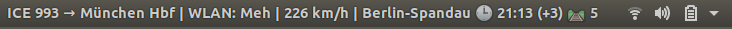

# GNOME Shell DB ICE Portal extension

This extension brings you the data from the ICE portal directly to your status bar.



## Setup

```sh
git clone https://github.com/mauricemeyer/gnome-shell-ice-portal.git ~/.local/share/gnome-shell/extensions/db-ice-portal@mor.re
```

Then restart your GNOME with `Alt + F2`, in the opening menu type `r` and press enter. If you use Wayland, you have to logout/login or restart your PC.

After that, open the GNOME Tweaks tool and under extensions, enable the extension.

## Inner workings

The extension queries both the `status` and the `trip` API of the ICE portal. Those are found at

* https://iceportal.de/api1/rs/tripInfo/trip
* https://iceportal.de/api1/rs/status

The data is then processed and displayed in your status bar.

## TODO

Currently, the extension has the following optimizable behaviour:

* request data from both the `trip` and the `status` API every 7 seconds, no matter what -> there is no checking if we are connected to the WifiOnICE yet
* if you disconnect from the WifiOnICE, the display does not get cleaned up, you will therefore have the last data displayed until you either; reboot your device, turn off the extension or restart GNOME.

The accuracy of the WLAN status could be optimized by reverse engineering https://iceportal.de/ itself as it uses both APIs to display its frontend.
